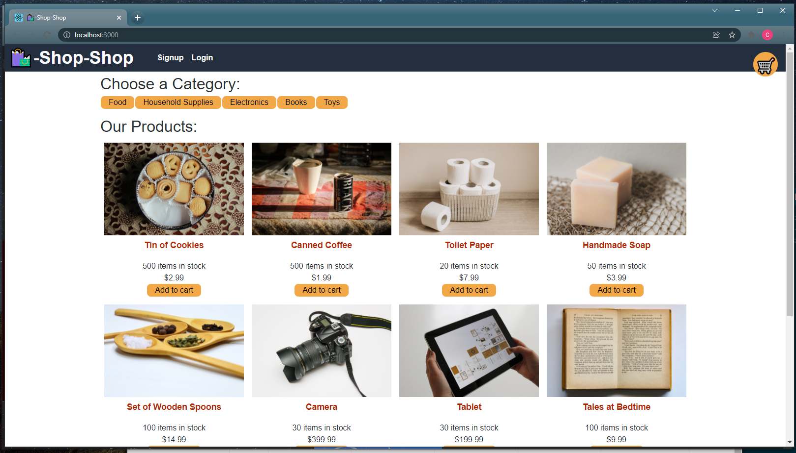

  

# Redux-Store
This is refactored code to implement Redux to manage global state.

## Table of Contents 
[Description](#description)  
[Installation](#installation)  
[Technologies](#technologies)  
[Usage/Link](#usage/link)  
[License](#licensing)  
[Questions](#questions)  

## Installation
After cloning this repository, install all dependencies by typing npm install in the terminal. Run npm start to start the application locally.

## Description
This is refactored code to implement Redux to manage global state.

## Technologies
Node.js 
Redux
MongoDb
React

## Usage
You can access the deployed application here: https://guarded-island-00612.herokuapp.com/.  

After navigating to the application through the link, users open to the home page.
  

Users can see their cart in the upper right hand corner and have the option to sign up or log in. Users can browse from muliple categories and add to cart.

## Licensing
Licensed under [MIT license](LICENSE).

## Questions
Email at whitcam20@gmail.com

